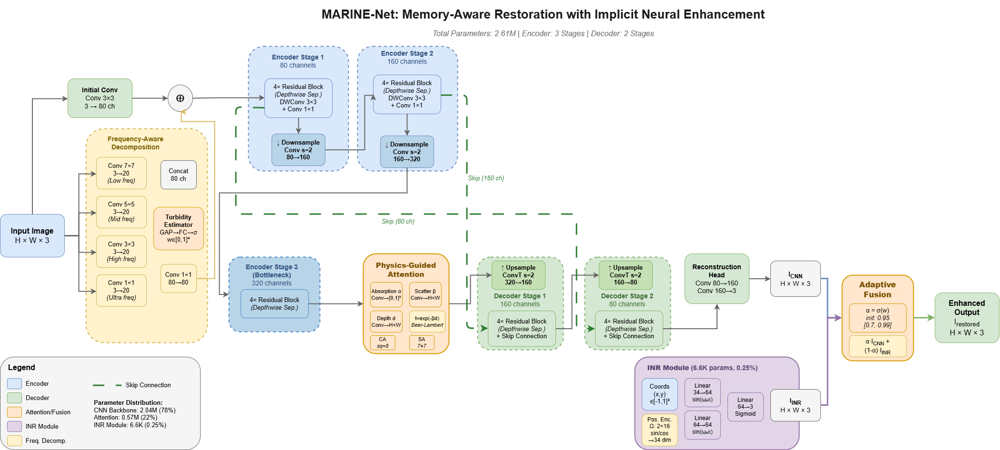

# MARINE-Net

**Physics-Guided Lightweight CNN-INR Architecture for Underwater Image Restoration and Color Enhancement**

Official implementation of the paper published in *Pattern Recognition* (Elsevier, 2026).

[](https://doi.org/10.1016/j.patcog.2026.114463)
[](https://doi.org/10.1016/j.patcog.2026.114463)

---

## Overview

MARINE-Net is a 2.61M-parameter hybrid architecture for underwater image restoration and color enhancement, designed to train end-to-end on a 4 GB consumer GPU. It couples three components:

- **Frequency-Aware Decomposition** with turbidity-adaptive band gating
- **Physics-Guided Attention** that embeds learnable Beer–Lambert absorption, scattering, and depth parameters *inside* the attention computation
- **A lightweight implicit neural representation (INR) branch** fused with the CNN pathway through a learnable scalar

On EUVP it reaches 28.34 dB PSNR / 0.900 SSIM, leads on the LSUI cross-domain benchmark, and runs at 14.8 FPS at 256×256 within 181 MB of peak VRAM.



## Repository Contents

| File | Description |
|------|-------------|
| `marine_net_model.py` | MARINE-Net model definition (headline architecture) |
| `train_marine_net.py` | Training script |
| `finetune_marine_net.py` | Fine-tuning script |
| `train_multi_seed.py` | Multi-seed training for the variance study |
| `evaluate_unified.py` | Unified evaluation pipeline (PSNR, SSIM, UIQM, UCIQE, NIQE, PIQE) |
| `marine_euvp_best.zip` | Pretrained weights (EUVP) |
| `marine_lsui_best.zip` | Pretrained weights (LSUI) |
| `marine_net_5d.py` | Independent 5D-INR diagnostic variant (see below) |
| `Arch.png` | Architecture diagram |

## Installation

```bash
git clone https://github.com/swamynathanvp/MARINE-Net.git
cd MARINE-Net
pip install torch torchvision numpy opencv-python pyiqa
```

## Usage

**Training:**
```bash
python train_marine_net.py
```

**Fine-tuning:**
```bash
python finetune_marine_net.py
```

**Evaluation:**
```bash
python evaluate_unified.py
```

**Pretrained weights:** unzip `marine_euvp_best.zip` (or `marine_lsui_best.zip`) before evaluation.

## Datasets

- **EUVP** — https://irvlab.cs.umn.edu/resources/euvp-dataset
- **UIEB** — https://li-chongyi.github.io/proj_benchmark.html
- **LSUI** — https://lintaopeng.github.io/_pages/UIE%20Project%20Page.html

## Independent 5D-INR Variant (`marine_net_5d.py`)

This repository also includes the **independent 5D-INR configuration** used as the controlled branch-decomposition diagnostic in the paper (Section 5.5.1, Table 9). Here the INR is given a fully independent, expressive per-pixel role, allowing each branch's contribution to be scored in isolation.

> **Note:** This is a diagnostic configuration for measuring branch complementarity, *not* the deployed headline model. The paper's headline results use the lightweight coordinate-only INR to meet the 2.61M-parameter, 4 GB-trainable budget. It is provided for reproducibility of the complementarity analysis.

## Citation

If you use this work, please cite:

```bibtex
@article{sriram2026marinenet,
  title   = {MARINE-Net: Physics-guided lightweight CNN-INR architecture for underwater image restoration and color enhancement},
  author  = {Sriram, Suthir and Vijayaraj, Nivethitha and Swamynathan, V. P. and Choudhary, Gaurav and Murugan, Thangavel},
  journal = {Pattern Recognition},
  volume  = {180},
  pages   = {114463},
  year    = {2026},
  publisher = {Elsevier},
  doi     = {10.1016/j.patcog.2026.114463}
}
```

## Maintainer

Developed and maintained by **Swamynathan V. P.** — primary contributor and corresponding author of the paper. For questions, please open an issue or reach out at vpswamynathan0311@gmail.com.

## License

See [LICENSE](LICENSE).
